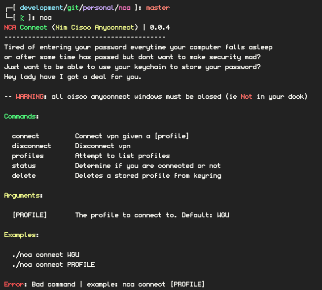

# NCA

Cli to login to cisco anyconnect client. Using the native keyring.



### Reason:

I am constantly frustrated with the vpn application and am much more interested in cli applications.
Thus nca was born, Nim Client for Anyconnect allows you to use a cli wrapper to interface with the 
cisco anyconnect client.

### Installation:

If you are on mac osx you can grab the release executable from the github releases page. Alternatively you can build from source:

```bash
git clone https://github.com/misterbianco/nca
```

#### Building

```bash
nim build src/nca.nim
```

If you want the most optimized binary:

```bash
nim build -d:danger -d:arc src/nca.nim
```

AND if you have an old phone @hikr17 I am looking at you
you can use sms instead of push notifications with the following switch

```bash
nim build -d:sms src/nca.nim
```

to strip the binary:

```bash
nim strip
```

and to pack the binary:

```bash
nim pack
```

and then run:

```bash
mv nca /usr/local/bin
```

Then you can run ```nca```!

### Usage:

You need to login using a profile, to find what profiles you have just run:

```bash
nca profiles
```

if your default profile is WGU then just run:

```bash
nca connect
```

*note:* on first run it will prompt for your password and store it in your keyring.

else

```bash
nca connect [PROFILE]
```

To disconnect from the cli

```bash
nca disconnect
```

To check the connection status

```bash
nca status
```

---

Written in [Nim!](https://nim-lang.org/)
